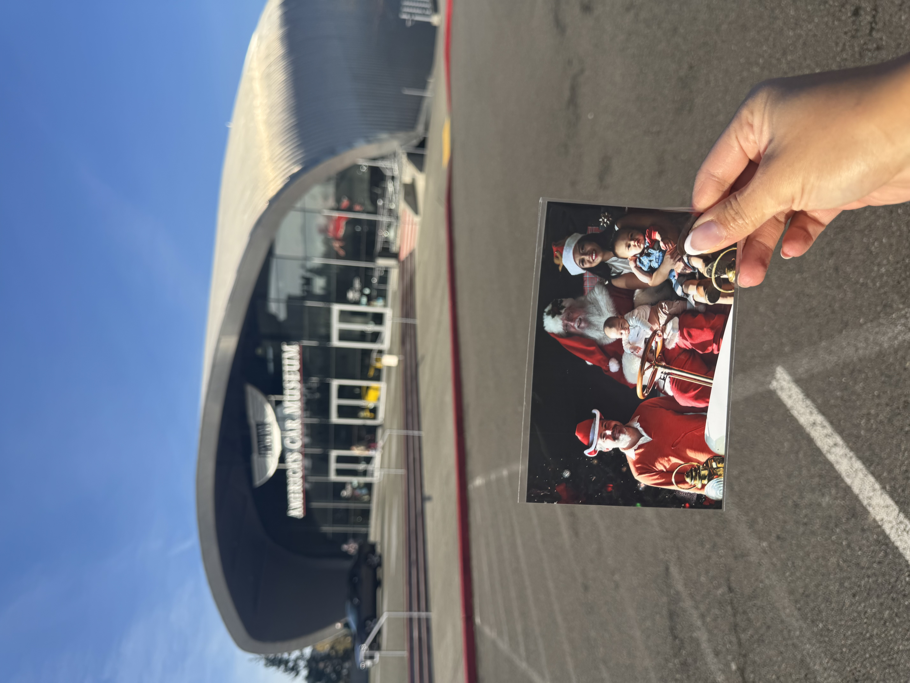

# 251128

Olive had used the scooter Linda sent him a lot this past summer in France.  On returning home, he had no desire to use it and the Woom bike I got him was too bike.  Then, playing with some friends, he saw their scooter.  Suddenly he's interesting in scooting again.

We scooted to the park.  We encountered kids I guess Olive has seen before.  Apple had met the husband.  I ran into the wife.  So, the kids recognized each other but the parents did not.

We went to the Lemay car musuem for pictures in a 1906 Cadillac with Santa.

Then to Costco for new tires.  Apple got the same snow tires the Nissan Rogue had.  We'll likely take the minivan to Mazama in January.  Hopefully we're all set for winter driving with it.

I'm wondering a bit about taking my paternity leave this winter and road tripping around the West a bit.

This morning on Nov 29, 2025, we rode to the Proctor market in the bakfiet.  Produce is getting to slim pickings.  Olive got a pear that was rather crunchy.  He enjoyed 1/3 cup of channa masala.

