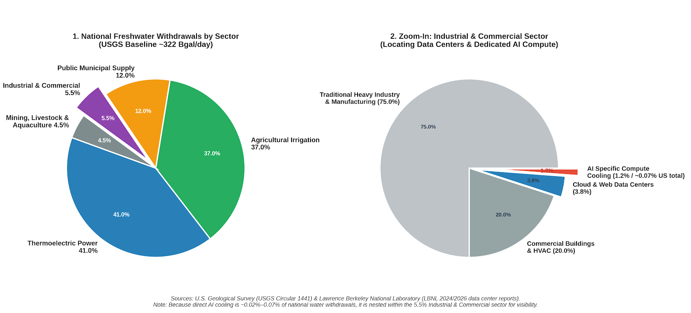

# AI Backlash

A while back a friend shared a writeup on the [three AI pills](https://thezvi.substack.com/p/the-three-ai-pills).  Personally I'm somewhere between 2 and 3, though increasingly bought into 3.

One of my quirks is that I try to speak with people who disagree with me.  That probably makes my life more streessful than it needs to be.  Though, I do think it does, on occassion, cause me to learn things.

Across artsy types attempting to make a living with their art, there's a broad based anti AI sentiment.  Here are two examples:

* [A cousin of mine](https://www.facebook.com/photo/?fbid=10242640520131864)
* [A fairly typical thread on an AI generated Magic card](https://www.facebook.com/groups/395579408681224/posts/1577702267135593/?comment_id=1577739593798527&reply_comment_id=1577890803783406)

The arguments against fall into some common brackets

## The environment

Something like "AI is draining all our water.  We'll soon live in an arid wasteland."  That particular one is easily falsifiable.  

I'm not quite sure why it has so much sticking power.

One blessing in the AI renaissance is that it may force the US to finally fix its antiquated power grid.  It also may be enough demand to revitalize fission and push fusion R&D.

## They stole everything

Another complaint is that AI was trained on the corpus of human knowledge.  There are many ways to go at this.

A trivial one is to look at Google search pre AI.  It scraped the internet in a very similar way, bunding up a map a user could then use to navigate.  AI could be thought of as an evolution of that.

You might also consider your own mind, trained on any number of artistic works, not properly licensed for reproduction.  Nonetheless, your mind uses those works to create derivatives that we call civilization.

There are other analogies.  Musicians love stealing from each other.  The entire pre written musical tradition must have been just that.  

Elvis famously performed music others wrote.  His performances (and probably skin color in the mid century South...) made the songs popular.  Similar questions can be raised for any "cover artist," asking if they are in fact artists.

Vanilla Ice, despite his protests to the contrary, likely borrowed a bit from David Bowie.  Funny enough "Man who Sold the World" as covered by Nirvana is currently playing in the burrito shop I'm sat in.

More recently DJs have made art sampling.  DJ Shadow is a favorite of mine.  Sampling caused all manner of hand wringing and lawsuits by the record companies and the artists they represent.

Then there's pop music, much I which I understand is a handful of clips reassembled under Rick Rubin's watchful gaze.

I am skeptical there is a fundamental difference between two turntables and a microphone, Pro Tools and your favorite AI.  The line is getting similarly blurry in the Adobe suite with functionality like "generative fill."

When prodded, the concern underlying this one isn't the AI.  Rather it's a lack of attribution and more crucially no distribution of royalties.  In short the problem isn't artistic, it's economic.

## What it makes is garbage

This is perhaps the most real.  I would argue that AI is a tool.  As such it can make bad things and good things.  Wielding poorly the output is poor.  I would be the first to admit I've made all manner of AI slop while trying to get to something good.

I suspect this comes down to information content, in the information theory sense.  High information work, such as [Gossip Goblin's videos](https://www.youtube.com/@Gossip.Goblin) has value and passes some ephemeral bar for art.

Other work, such as a one sentence prompt novel, is just schlock.  Of course, AI wasn't neccessary to create this sort of schlock.  [Pride, Prejudice and Zombies](https://www.amazon.com/gp/product/B01MY58ICH) was written in 2017.  There are hundreds of derivative Star Trek and Star Wars books.  Though I will admit there are some gems hidden in the piles of derivative dreck too.  That is true of all art.

I wonder what the correct measure of information is.  I was reading up again on mutual information and entropy.  It's a subject I seem to come back to in some context every five years or so. I think there's something there but I can't quite articulate it yet.  [Here's](https://wideopenweb.github.io/feed/index.html?owner=benofben&repo=benlackey&post=Information+Content+in+AI+Output) a lightweight writeup.

## Art requires effort

This can be characterized as "A person typing a prompt to generate something isn't an artist."

I think you can trivially concoct a slippery slope here.

"Someone typing a novel into a word processor doesn’t make them an artist."

Or for a more piecemeal part of a final artistic product

"Someone typing a screenplay into a word processor doesn’t make them an artist."

On the visual front, you have painters like Jackson Pollock and my two year old.  The output has a certain similarlity.  Unfortunately his productions are not worth millions, though I would argue they constitute a sort of art.

Ultimate the underlying argument here comes back to information theory.  The bad art isn't novel, doesn't excite, is missing something.  I suspect that is because it is generic output from the AI.  That means it is generic human knowledge.  Which means it is already well understood in our society.  So, it doesn't make good art.
