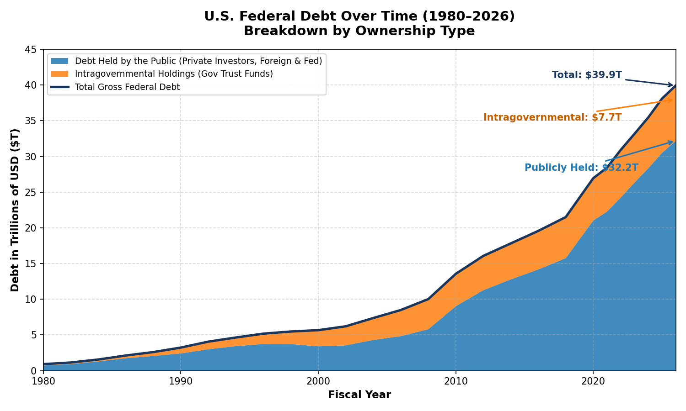
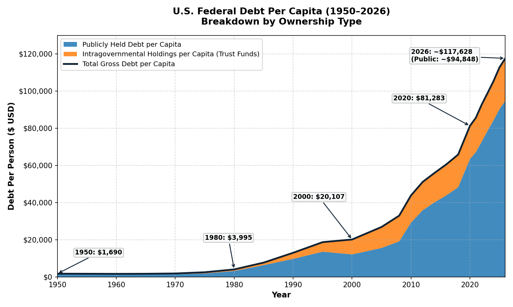
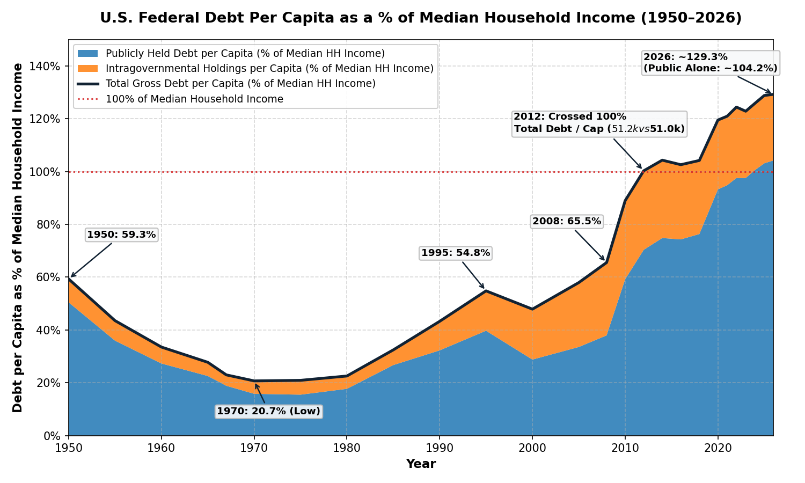
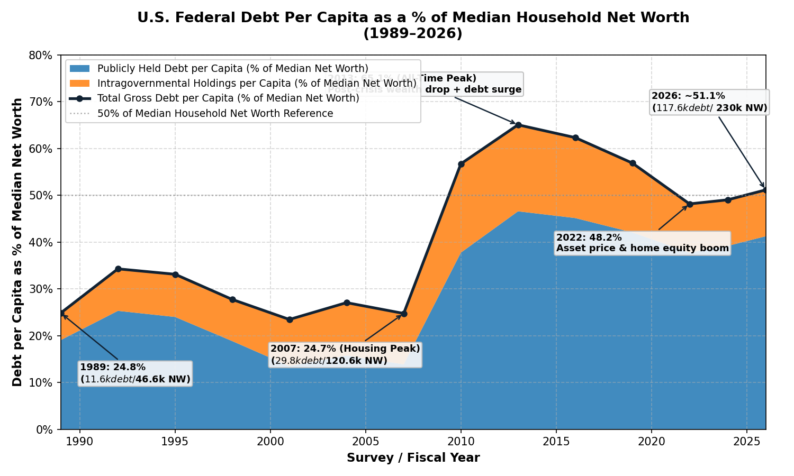
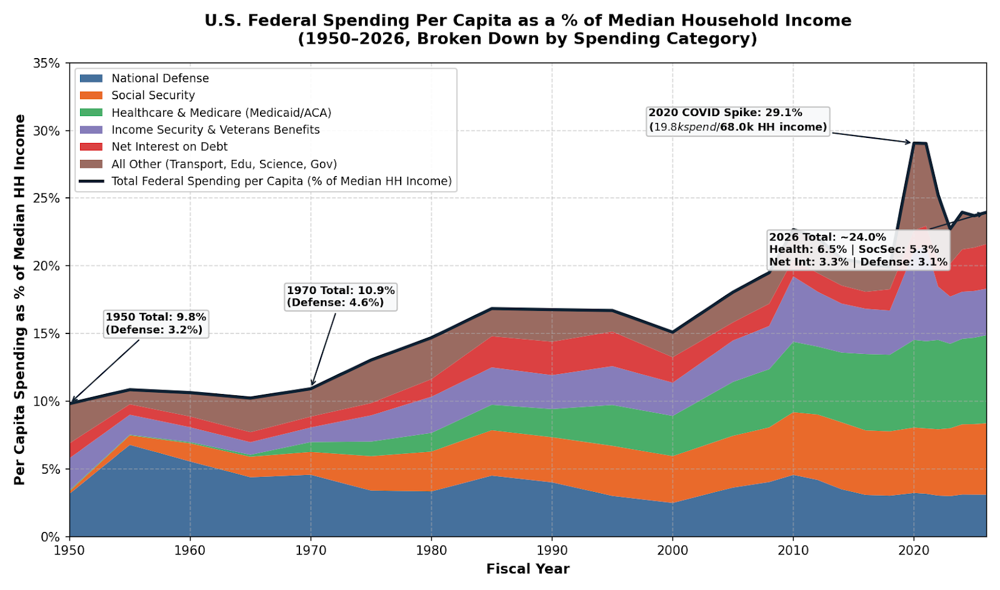
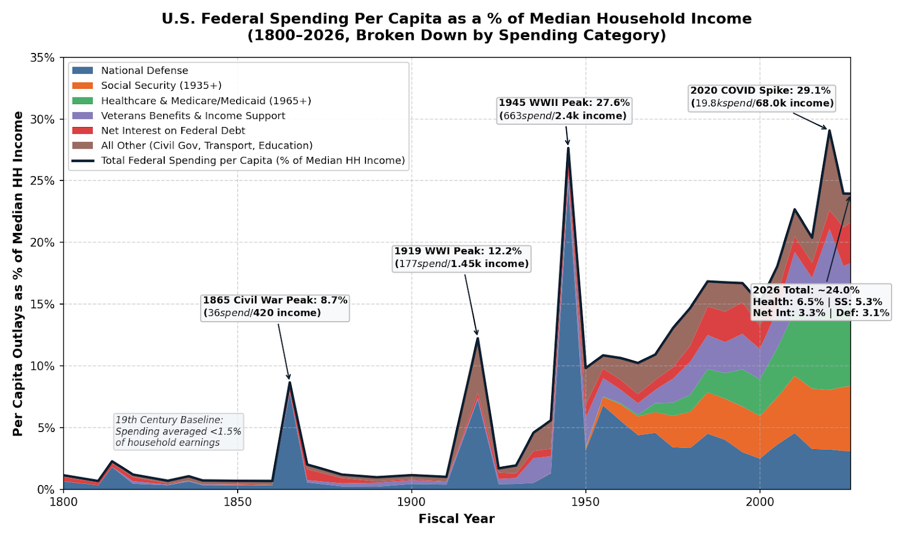
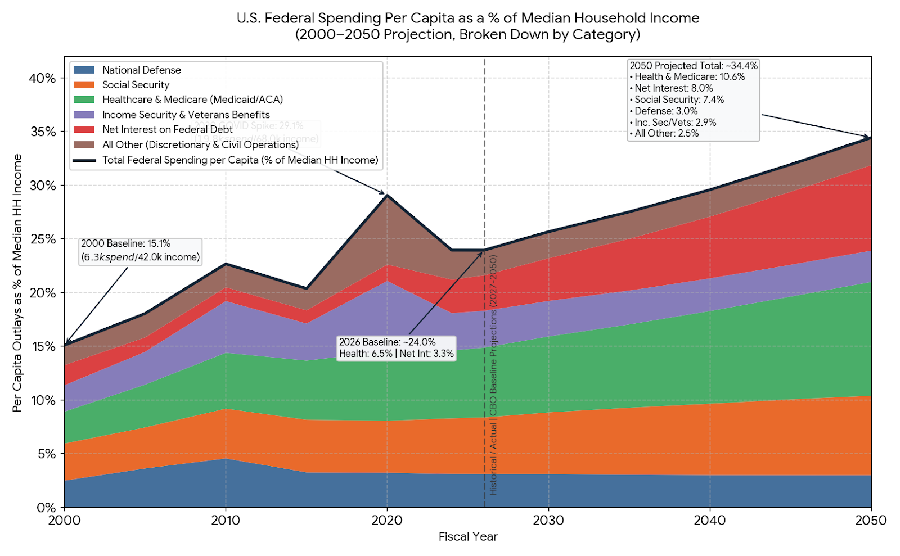

# Deficit

I'm continuing tinkering with Gemini, trying to think what it is most useful for.  I read earlier today that the federal deficit just crossed $40T.

## The Federal Deficit

So, here's a graph:

That got me wondering what it looks like per capita. 

Of course the two year old isn't really pulling his weight yet.  So, I ordered up a graph showing the per capita debt as a percentage of median household income.  129% seems to be the answer.

However, it seems unlikely that we'll start paying more taxes to pay down the debt.  That then got me wondering about net worth.

That seems perhaps the best way to thing about this.  It shows what would need to be taken from each household to balance the defit.  Of course, that too is ridiculoulsy unlikely.

Dalio lays out a three part program to fix the issue:

1. Spending Cuts
2. Taxes
3. Monetization

He recommends a balanced mix of all three.  I think we're going to continue to not act and pick a focus on 3 as an unintended default.  Though we currently seem to be increasing both taxes and spending, with spending outpacing the new taxes.  There's a hilarious Cato paper on the subject showing what impplementing the DSA's platform would cost.

Dalio's belief seems to be that we will spend until we can't.  He argues that previous regimes did something similar.  Being the reserve currency enables that process to go on much longer than otherwise.

## The Federal Budget

That got me wondering how the federal budget has changed over time.

Unsuprisingly it's grown as a percentage of median household income.

Going further back in time we see that the current spending levels are roughly equivalent to when we were fighting WWII.  That and the $4.6T COVID stimulus are the two highest points in the history of the country.

A projection out to 2050 then looks like this.

Interest payments go from 3.3% of median household income to 8%.  Along with healthcare and SS, that's the top three.  Spending foes from 24% to 34% of median household income.  It's hard to reason about what a characteristic income tax rate is.  However, it is clear that would have to go up, either directly or indirectly through massive inflation.

## When will it end?

"If something cannot go on forever, it will stop." - Herbet Stein

This regime clearly cannot continue indefinitely.  Eventually the tax burden will be greater than income.  The debt creation will outpace any market for that debt.  Somewhere in that cycle this will end.

When it does, Dalio predicts a retreat to hard money.  That is because government is no longer trusted to not debase the currency.  I'm seeing that in a small way in local politics.  The government of Tacoma passes bonds for public goods (parks, streets, schools) and then spends the money elsewhere.  Despite record receipts, the city has a deficit.

Because the dollar is the reserve currency, the US doesn't need to default.  We can just print away our debts.  The result is very similar.  At that point, we've squandered loans in the trillions from foreign governments.  We have squandered decades of our population's productive labor.  But that's all water under the bridge.

In that moment, a modern metaphor might be Greece circa 2012.  The endless public sector sinecures and limitless entitlement programs all stop.  Cuts deeper are needed.  Basic services such as road and sewer get cut.  Maitenance is further deferred.  It creates a vicious cycle.  The lack of productive investment slows the economy.  There is recession and real wealth destruction, not just inflation.

Following Soros' reflexivity theory, that overshoots.  We don't hit the bottom, instead we probe a bit below.  Finally in there people notice opportunity. Things have become cheap enough, infrastructure poor enough that there is low hanging fruit in productive labor.  Then the swing up again.  Dalio calls this the long credit cycle, differentiated from the short ~10 year cycle we see many times in a single lifetime.

All this is hard for me to reason about.  I know intellectually it will probably happen.  But emotionally, the US has been on a constant rise my entire lifetime and my dad's too.  You have to go back to 1929 to get a meaningful dip and even that was a 10 year anomaly in a 200-500 year story of up up and up.  It is antithetical to the American mind.

Europe has lots of these stories.   Spain, Portugal, Greece, Italy all spring to mind.  Today those economies are essentially zero sum, with little growth.

## The way out

I wonder if we'll find a way out.  Going back to Dalio's program:

1. **Spending Cuts** -- We make massive cuts to medicare, medicaid and social security.  The medical cuts are perhaps made less painful by medical advances.  Similarly the social security cuts could be made less painful by productivity gains.
2. **Taxes** -- I don't see how we can long term increase taxes.  This part of Dalio's program works to plug the gap.  But longer term people want to own the fruits of their labor.  Readjusting back toward historic norms seems more likely.  Than means more cuts not more taxes.
3. **Monetization** -- The lazy man's tax solution seems inevitable.  As things get worse, we'll badly debase the currency.  Holding debt seems a poor choice in the likely upcoming regime, particularly if it is long maturity fixed rate debt.

AI and an upcoming space race could mitigate this mess.  I already noted how technology could improve the impact of likely cuts needed in 1.  If we get serious about the space race, I wonder if it will be a new wild west, new world and new frontier.  The regulatory regimes in England became irrelevant as people filled up the 13 colonies.  Maybe we'll see something similar, though that could take 50, 100 or more years.
