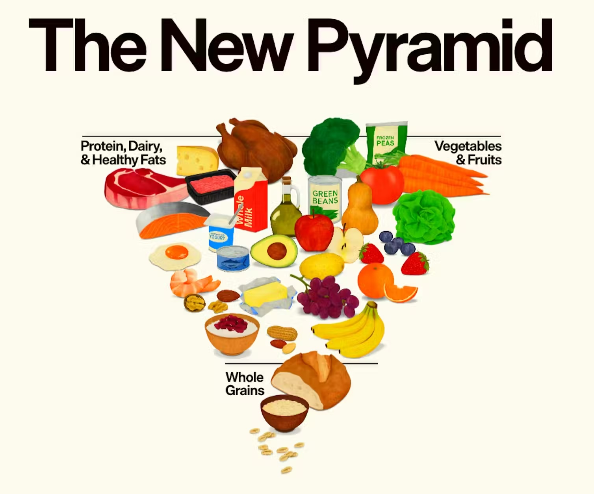

# Eat Food
The Wikipedia page on the Food Pyramid is a good read: https://en.wikipedia.org/wiki/Food_pyramid_(nutrition)

There’s an old wheel from 1946.  Then there's the pyramid I remember from 1992 which is apparently based on a Swedish thing from 1974.  Finally there is RFK’s new one, though it’s missing from the page.

The government has a page here: https://realfood.gov/

RFK is no doubt crazy in many ways.  If you actually look at this recommendation though, it’s not a crazy thing as many of the news stories I’ve read state.  Instead, it’s straight out of Michael Pollan’s “Eat food. Not too much. Mostly plants.”  

So, bizarrely, the right wing has now arrived at what the touchy feely left wing foodies were advocating 20 years ago.  And now we have people on the left who are going to protest the trickle down of all this into food stamp programs by drinking coke.  That'll show those mega corporations who's boss!  Things are very strange.