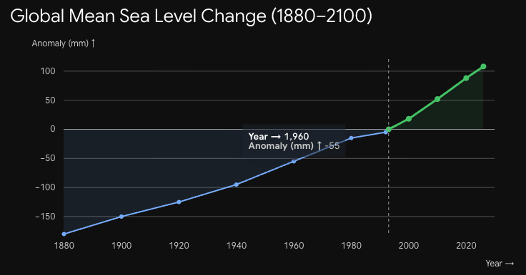
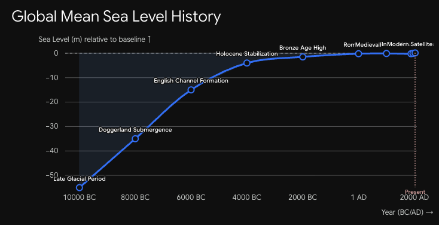
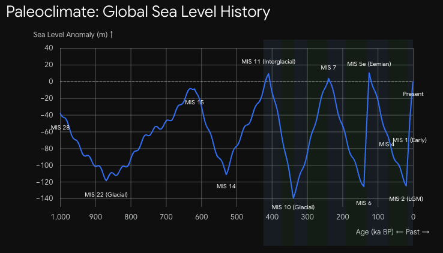
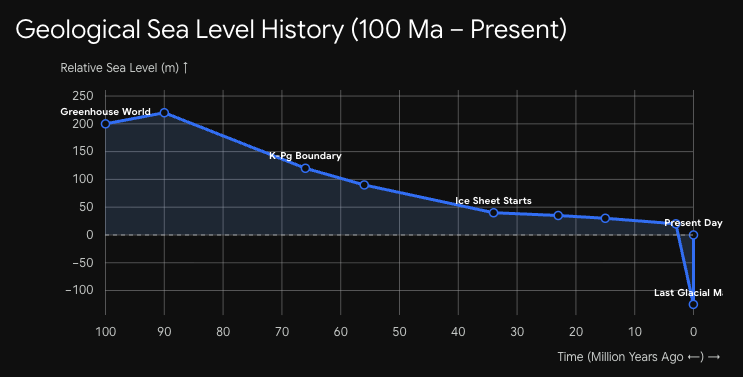
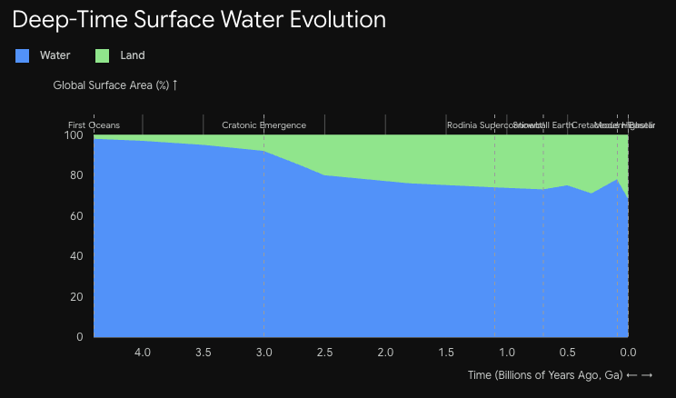
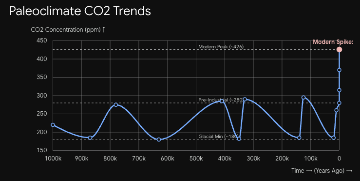
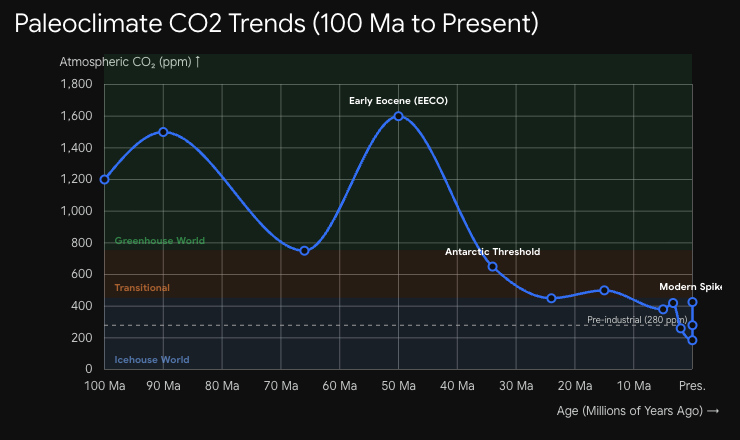
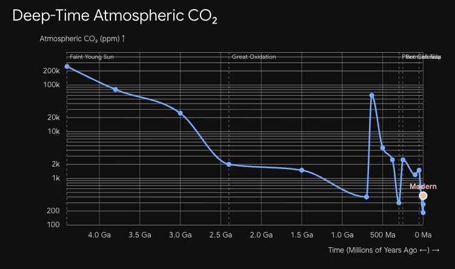

# Geologic Time

Many news articles open with something like "indicator X reaches record."  That record is often not an all time high.  Even if it is a nominal all time high, when adjusted properly, perhaps for inflation or population growth, it is not.

Putting things in their proper context lets us reason intelligently about them.

## Sea Level

One example is sea level rise.  On one side doomsayers will claim the sea is rising to wipe us all away a la Noah.  A graph such as 1880 to a projected 2100 looks rather concerning.

On the other are pithy pictures of Plymouth rock, still visible.  Proponents of that view might show a graph back to 10,000BC.

To understand what is really happeneing we need a proper time window.  For things that are cyclical, such as sea level, I'd like to see multiple cycles to understand context.  I know, for instance, that sea level goes up and down with glaciations.  Those happen on time scales on 10k years.  So, the 10k window is too small.

That leads us to a 1 million year graph.

In this view we see that the current sea level is high.  However, it is not a record high.  And it is within bounds for the million year time period.  This then allows us to start asking questions.

* What was the world like last time sea level was like this?
* Would we want to live in a that world?
* Are we in an unprecendented situation?
* Are we on a path to end up in an unprecendented situation?

Those questions then lead us to zoom out a bit more, to a 100 million year window.

We now see that sea levels are actually fairly low.  One reason is because we have ice caps.  For much of the world's history there were no ice caps.  Dinosaurs roamed the earth 60m+ years ago.  It was a very different world that mammals didn't do so well in.

Oceans formed 4.4B years ago.  The depth relative to present numbers break down in this extreme.  But we can look at percent of the global surface that was water.

Amusingly, the unprecedented trend is not toward more ocean but less.  With our multi billion year outlook, we see less and less ocean, not more.

Now, let's zoom way back in.  When looking at the 1 million graph, we were able to see several ice ages.  So, we got an idea how sea levels changed over time in cycles.  With this representative data we can then ask what a represenative change over a particular period of time is.  For instance:

"What is the typical annual rate of change in sea level over this period?"

Gemini gave this --

Overall 1-Million-Year Average: If you simply take the total absolute vertical distance traveled across all cycles (~10 complete swings of ~130 meters down and up ~ 2,600 meters total movement) divided by 1,000,000 years, the baseline background velocity is roughly 2.5 to 3 mm/year in absolute magnitude.

Modern Anthropogenic Comparison: Today’s satellite-measured rate of ~ 4.5 mm/year is roughly 10 to 20 times faster than the natural late-interglacial background rate, and it is approaching the speeds normally seen only during major deglacial terminations—despite occurring during an already warm interglacial when major continental ice sheets (outside Greenland and Antarctica) no longer exist.

## CO2

And now we're getting somewhere intersting.  The rate of change is high.  But not unprecedented.  Digging, Gemini thinks CO2 release caused it.  That then leads to an obvoius questions.  What's the CO2 graph look like.

We get another one of this "OMG we're all dead" kinda graphs.  Al Gore famously showed something like this in "An Inconvenient Truth."

But, let's keep our wits.  The earth probably looked like this before.  When?  Zooming out to 100m we see.

Now we see that Gore was being a bit melodramatic.  CO2 levels are high and spiked fast.  But they're well below historical highs.  Though, once again the world was a rather different place.  There were dinosaurs, jungles and no ice sheets.

Back to our extremes, let's zoom all the way out.  We see now that CO2 levels are actually near all time lows.  Though, earth wouldn't have been a great place to be a homnid in 4.4B BC

Short of us dropping a black hole into the earth's center, collapsing the planet, it's difficult to imagine a scenario where we destroy all life on earth. Even scenarios where we destroy all animals are hard to come by.  We're not capable of building much that will last 1000 years, certainly not 1m.  In all likelihood our longest living artifacts will be those that made it into space.

That, and our contribution to entropy...  While we can't create much that is long lived, we can perhaps cause extinctions significant enough to be viewable in the fossil record, even if life knits itself back together with our passing...

On our time scale, it is highly possible that we screw things up to a sufficent degree that millions or billions become displaced or starve.

Climate changes have causes smaller scale impacts with humans throughout our history.  It's no accident that our civilzation dates from 10k years ago as the ice sheets retreated.  Somewhat more recently, Scara Brae was a prosperous fishing village 5000 year ago.  One theory is that climate changes, colder in this case, collapsed the fisheries and their population with it.

Similar theories of poor cropland are one explanation why the Vikings felt the need to sail around the pillaging the north.

It's not hard to imagine something similar playing out in a modern context.  Certain areas become harder to live in.  The inhabitants leave for greener pastures.  That leads to upheaval and war.  "The Day After Tomorrow" had a scene with Americans fleeing the frozenn north for Mexico.  Mexico put up a border wall to keep them out.  The scale would be larger than previous impacts, if only due to population density.

Presumably these are things we want to avoid.  That is likely not done by trying to attain some perfect static state of nature.  Rather we use our minds to better understand the earth as a dynamic world and live in that.

## Conclusion

If you like learning about Ice Ages, [this](https://www.amazon.com/dp/1511926422) was a great book on the topic.  It's one of the few things I've read recently putting things in proper context.

[Robert Sawyer's Homonids](amazon.com/dp/0765345005) books are also fun, imaginging a parallel earth where the neanderthal never went extinct.  In them New York Harbor freezes over every winter.