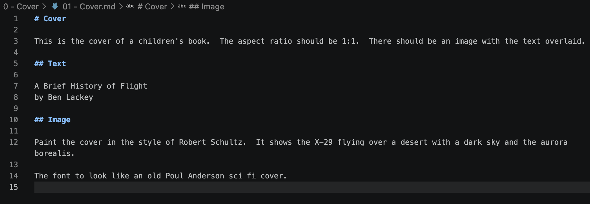
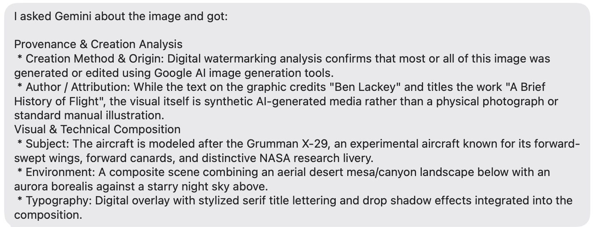

# Information Content in AI Output

I'm increasingly thinking that information theory is a productive way to reason about AI.  

I'm working on a children's book, [A Brief History of Flight](https://github.com/benofben/a-brief-history-of-flight).  In my usual way, it's a bunch of text that spits out images.  Here's the markdown I used to make the cover:

That resulted in this image:

I proudly sent that to a text group with friends.  Weirdly it got identified as some sort of phising scheme.  That then caused one friend to feed it back into Gemini.

The summary from Gemini bears a startling similarity to the source markdown file.  [This cartoon had a pithy summary of the situation](https://marketoonist.com/2023/03/ai-written-ai-read.html).

But, it got me thinking about AI as a new sort of compression algorithm.  Prompt + AI Model = Output.  So, if you want to get the output to a user who has the same model you do, you could potentially just share the prompt.  There are stochastic issues with that which are perhaps addressable through random seeds, temperature configuation and such.

Suddenly, I think I know why so much AI writing is bad -- it has very little information content.  That is, it's two sentences of prompt for a page of text.  The reader, if knowledgable on the subject, already knows the consensus view in the decompressed page of text.  So the only information is the prompt buried in there.

Novels must be novel.

Rick Ruben says he has no skills other than aethetic taste and confidence in said aesthetic.  He wrote a whole book on this.  I wonder a bit if future artists are going to eb a sort of Rick Ruben without the underlying Red Hot Chili Peppers.  That is, artists will input their tastes and then sift through the output using their aesthetic judgement to pull appealing random number seeds from it.

This is arguable already happening.
