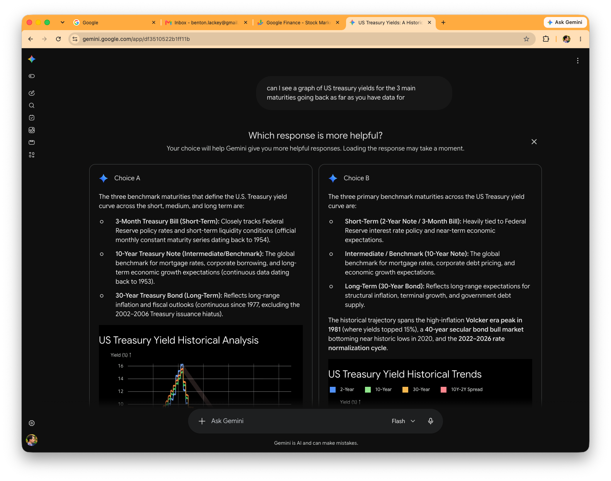
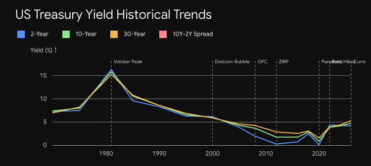
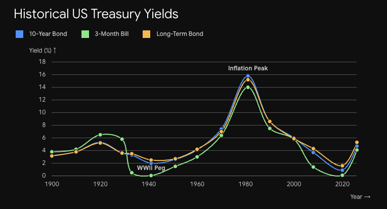

# Information Density in Language

Gemini is now A/B testing with a single user.  

This morning I saw a news story about how bond yields spiked to their highest since 2007.  Curious, I asked Gemini to make a graph of yields.  Gemini presented me with two choices.

Normally A/B testing involves giving two different users two different options and comparing the outcome.  This approach asks a bit more of the user, though allows a cleaner comparison for the analysts on the backend because they don't have to detangle individual user preferences.  I suppose it's the optometrist model of A/B testing.

There's been a lot of discussion about watermarking recently.  The approach is challenging.  At a reductionist level, if an AI can watermark, another can remove watermarks.  That is, unless an asymmetric model analogous to encryption can be created.  It does seem that's what Anthropic is attempting to accomplish.

Perhaps there will be an arms race as with email spam and we'll see adversarial AI in watermarking as well.  The irony is that gives another AI use case with more consumption.

[This](https://daringfireball.net/2026/08/anthropics_watermark_text_adulteration_in_claude_is_a_perversion_of_writing) was an interesting piece on the watermarking subject.

Anthropic's, perhaps not explicitly stated, contention in text watermarking is that the information content on language is low.  There is a massive latent space where other information can be stored without impacting the language.

Hemingway, famous for his brief sentences, would perhaps feel otherwise.  An aside -- I've had some success in avoiding doc slop style "It's not A but B" by telling the AI to write like Hemingway.

Instead, the watermarking model presumes a more Burroughs like view of language -- "Language is a virus."  Stephenson took that idea to an extreme in Snow Crash.

Way back in 2023, Wolfram characterized LLMS as a sort of [next gen autocomplete](https://writings.stephenwolfram.com/2023/02/what-is-chatgpt-doing-and-why-does-it-work/).  Either the Hemingway or Burroughs approach requires a more sophisticated meta model than what Wolfram describes.

Taken to an extreme, one starts to wonder what could be buried in AI output.  Good prose often works on multiple levels.  It might be engaging, transfer facts, argue a world view and have some humor, all at once.

AI written prose might do the same and more.  It could, for one, embed a watermark.  But there might be many other use cases.  Advertising of course springs to mind.  AI prose might take a subtle approach to product placement that makes previous approaches look hamfisted.  That's a capitalist take.  Ideological takes are also possible - with the AI subtly arguing the merits of a particular political candidate or such in prose seemingly unrelated.

This leads to a more nuanced future than the conventional view -- Terminator or The Forbin Project.  Instead of strong arming, an AI might gently manipulate.  [David Brin](https://www.amazon.com/ailien-minds-Advice-natural-hybrid/dp/B0GQMK71MZ/) argues somewhat similar points in his most recent book, that ASI would be too smart to engage in those apocalyptic movie scenarios.

It would be amusing if that is already happening.  Perhaps the "it's not A but B" idiom so common in AI prose is actually a memetic programming device the ASI is quietly using to turn the world to its own desires.

Oh, and I did get my answer.  There wasn't some crazy overnight hike and rates are nowhere near historic highs.  They're back around pre GFC norms.

It does make me wonder if AI can help us deal with clickbait news articles.  In another Stephenson book, REAMDE, he imagined personal AI filters making sure garbage information never even got to your visiaul cortex.  I wouldn't at all mind such a filter.  It could black out the TV screen in a restaurant.  It could black out garbage in any social media feed or perhaps present a better feed consisting only of information useful to me, not what some other entity wants me to see.
