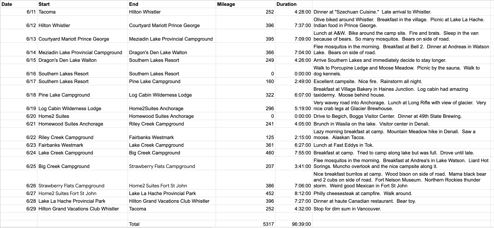
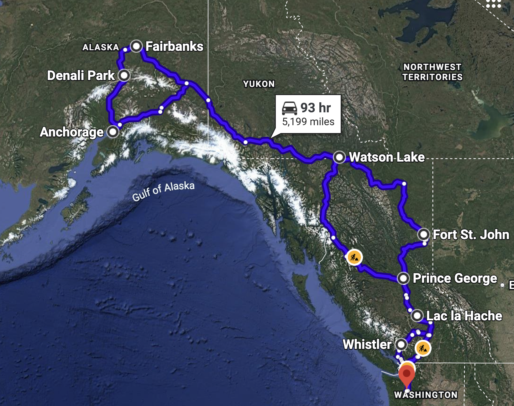

# Notes on the State of Alaska

This summer we drove to Alaska.  I want to get a bit of that down on paper before it completely departs my mind.  [This is the route we took](https://www.facebook.com/events/2398712173951644/?acontext=%257B%2522event_action_history%2522%253A%5B%257B%2522surface%2522%253A%2522group%2522%257D%5D%257D).

Here it is in [Google Map form](https://www.google.com/maps/dir/Tacoma,+Washington/Whistler,+British+Columbia,+Canada/Prince+George,+British+Columbia,+Canada/Watson+Lake,+Yukon,+Canada/Anchorage,+Alaska/Denali+Park,+Alaska/Fairbanks,+Alaska/Fort+St+John,+British+Columbia,+Canada/Lac+la+Hache,+British+Columbia+V0K+1T0,+Canada/Tacoma,+Washington/@54.2406253,-155.9694489,4768830m/data=!3m2!1e3!4b1!4m62!4m61!1m5!1m1!1s0x549054ee2b659567:0x62219c07ebb09e82!2m2!1d-122.4419643!2d47.2551307!1m5!1m1!1s0x54873cb203957b87:0x4ab741e875f5cff6!2m2!1d-122.9535117!2d50.1161686!1m5!1m1!1s0x538898f7ef590fe9:0x50135152a7b3050!2m2!1d-122.7496693!2d53.9170641!1m5!1m1!1s0x53fb59a95bb32ca3:0x8e010d3860a6ee53!2m2!1d-128.7161526!2d60.0629621!1m5!1m1!1s0x56c8917604b33f41:0x257dba5aa78468e3!2m2!1d-149.8996784!2d61.2175758!1m5!1m1!1s0x56ccdf5119bf48fb:0x7cdaaedf368f0f46!2m2!1d-148.8339521!2d63.6546041!1m5!1m1!1s0x5132454f67fd65a9:0xb3d805e009fef73a!2m2!1d-147.7199757!2d64.8400511!1m5!1m1!1s0x539249b23cd026b5:0x56ba966ece75ce0a!2m2!1d-120.846409!2d56.252423!1m5!1m1!1s0x5380617021a528ab:0x3f7f7d36947d57fb!2m2!1d-121.4720029!2d51.812737!1m5!1m1!1s0x549054ee2b659567:0x62219c07ebb09e82!2m2!1d-122.4419643!2d47.2551307!3e0?entry=ttu&g_ep=EgoyMDI2MDgxMC4wIKXMDSoASAFQAw%3D%3D).  I've saved a render here for posterity.

## Endless Daylight

I knew intellectually that the days would be long.  Somewhat accidentally we were in Fairbanks for the solstice.  I believe the sun set around 1am and rose at 3am.  Those numbers are fairly theoretical however.  It doesn't get dark.  The dead of night, 2am is like a slightly cloudy day.

Experiencing this, it suddenly made sense why all those migratory birds pop up north.  Their young get a summer of compressed youth with endless time to learn.  Once again, I'd understood this intellectually, but seeing it really made it click.

Similarly the temperature weren't particularly hot, maybe 70 or 80.  However, I think that since nothing ever got the chance to cool down, it felt toastier than it was.  That, I suspect leads to some of the most horrifying mosquito conditions I have ever experienced.

Previously I'd thought of buying 100 acres and living in Alaska.  The daylight cured me of that.  Somehow endless night is more palatable.  I heard locals observe the same.  Winter wasn't too hard to adjust to.  Summer was.

## Drunken Forest

I'd read about drunken forests.  Melted permafrost causes shallow root pine forests to stick every which way as they drown in swamp.  This is another thing I understood intellectually.  Seeing 2000 miles of it was something else.  I am amazed we don't read more about this.  From what I can tell a substantial chunk of North America is changing into something else.

These pine forests are in many cases already dead, just miles and miles of dry logs sticking out of swamp with mosquitoes buzzing around and moose foraging.  Spotting a niche, new plants are moving in.  Birch and aspen are growing into the edges.  I wonder if they haven't made it into the middle due to the acidity of the pine trees.  Perhaps that will take a while.

This has all happened before.  Over tens of thousands of years ice ages come and go.  Glaciations wipe the north, then retreat.  Grasses first, then pines and finally the decidous trees.  I really wonder what this change means for Alaska.

At Denali there was a sign with an apocryphal Jefferson quote: "not in a thousand years will the country be thoroughly settled as far west as the Mississippi."  The Denali sign then said something like "it only took 100."  That statement blatantly ignores the vast tracts of completely empty land where not only are there no buildings but, unlike Europe where most places were at one time settled even if they have since gone a bit feral, man has never built anything there.  

The sentiment that we're running out of land is pretty typical of a certain boneheaded variety of conservation.  That same sentiment is the reason the main road through Denali was closed to cars.  I hope we build more infrastructure so we can better explore these places.

I've seen projections showing the American bread basket moving north from Kansas into lower Canada.  I really wonder if these forests become arable land.  One could image converting the swamps to ridicoulously productive rice paddies for part of the year, though frozen waste for part too...

## Fire

Thinking through the implications of the drunken forest, I believe we're in for a lot more fires.  Fire season in the PNW has already become quite a thing.  It's great for morels but leaves you feeling lightly smoked.  I suspect there are multiple causes contributing in parallel:

1. **Human caused carbon emissions** - I have no doubt this has contributed.  At the same time, I think it dishonest to argue that as the sole cause.

2. **Bad forestry practices** - The forest service in the US has been engaged in bad forestry practices for a century.  
Trump was made fun of for suggesting sweeping forwards.  Memes of brooms and such abounded.  However cleaning undergrowth is how commercial forest management works.  I suspect that approach emulates old growth where extremely large pine trees eventually poision everything on the ground with the acidity of their needles.  In old growth, periodic fires take the low branches, resulting in a suprisingly open forest.  Maybe we don't need to sweep the forests exactly but an approach similar in spirit would reduce fires.

3. **Putting out every fire** I suspect forest fires are a self organized critical system.  That is, like an anthill.  In an anthill sand grains are added and added.  Periodically the hillside fails, reorganizing itself.  I suspect the fire regime is similar with unburnt wood building up and up till a single spark lights a considerable blaze.  Smaller fires along the way would eliminate the world ending fires.

In this, I'm reminded of SimEarth.  Without perturbation, the model tended toward a world of pine forest, much like the Le Guin book.  However the forest produced an enormous amount of oxygen.  Once the atmospheric oxygen content got him enough, fires would break out easily, burning the forest back to grassland.  I really think we're seeing similar loops play out in the PNW.

This makes me wonder where the system will settle.  Presumably we'll get our carbon emissions under control.  If nothing else we'll burn the readily available gas and end up living in a Mesozoic jungle.  If we're really dumb, we'll burn all our coal. Regardless, we'll settle into some new regime.  However, along the way the existing forests are going to change.  

In Colorado, beetles have killed many of the pines.  Those desicated forest then burn and are replaced by grass, sparse forest and aspen.  I suspect we're experiencing something similar, but on a much more grand scale in the PNW.  Maybe the buffalo can roam again.

## Alaska is really far north

I know, I know.  It was just strange experiencing it.  I remember the day we got back "south" to Lake La Hache and the sun actually properly set.  It got dark for the first time in two weeks.

I've driven into Canada during the winter to go skiing.  Places like Kamloops or Revelstoke felt like the northern ends of the earth.  Those were the extreme south part of our trip.  One of my favorite spots were some cabins along a lake in the extreme south of the Yukon, further north than I'd previously been in North America.  That was called "Southern Lakes Resort."

The world is a big place.
