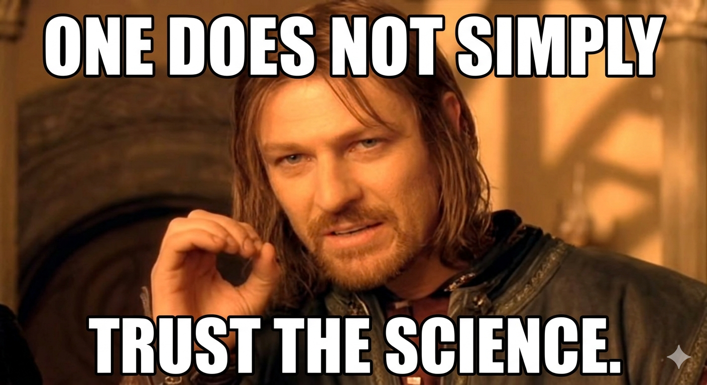
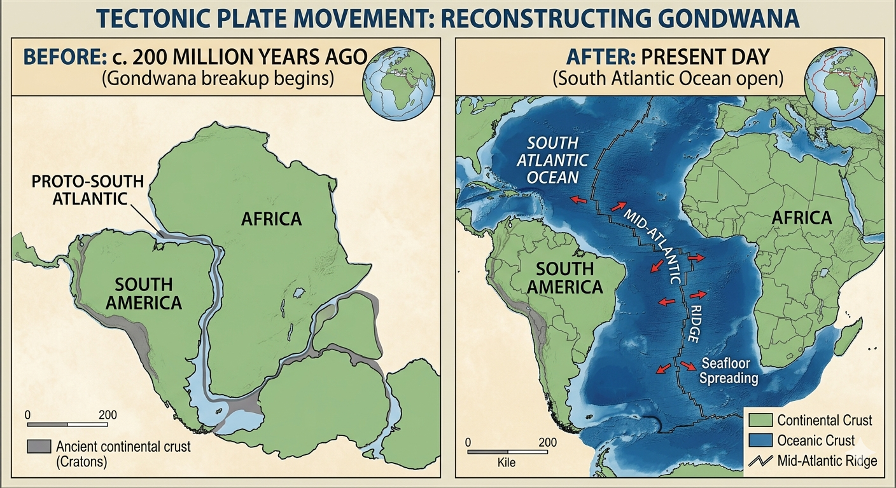
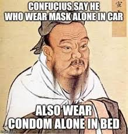
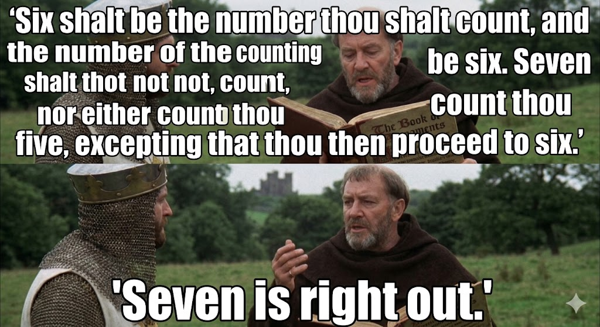
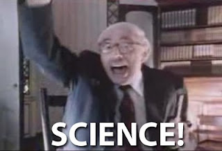

One of the most bleakly, unintentionally hilarious things to come out of COVID was the phrase "Trust the science."  One does not trust science.  Instead science is questioned rigorously using the scientific method.  If one does not do so, the thing being practiced is not science, but religion or dogma.  Ironically religion is the very thing many of the people saying "Trust the science" claim to hate.

Questioning the status quo has long been a dangerous sport.  Socrates and Gailileo provide examples across millenia of how poorly that can go among the wrong crowd.  

In The Structure of Scientific Revolutions, Kuhn discusses how ideas shift.  His model is slowly and then quickly as an idea takes hold.  In slightly darker humor, my dad used to describe how plate tectonics took hold in geology -- the people who were dogmatically against it died of old age.  A younger generation with papers to publish and more flexible minds were able to follow through the implications of Africa and South America fitting together on a map.

During COVID we were told to do many crazy things.  If we questioned, the "Trust the science" phrase was rolled out.  If something seemed insane, say wearing a surgical mask outside in the woods or alone in a car.  Similarly we were told not to visit our elderly parents.  We were told to stand 6ft apart because apparently 3 is not the magic number.

All this brings us today with the tyranny of the experts.  A variety of nutty ideas have become popular in the PNW to deal with the homeless / drug mess.  One is "housing first," a notion that everyone on the street, addicted to drugs who refuses a shelter bed should be given their own 1 bedroom apartment.  Supposedly this idea is supported by science.  I have no idea what science.  I've had the misfortune to run small scale experiments on this subject myself -- cleaning up rental properties after much better behaved tenants (mere alcoholics).  I can only imagine the damage a fentanyl addict would do to a place they got for free.

Other programs like [anti homeless boulders](https://www.reddit.com/r/TacomaPolitics/comments/1sh6vke/the_cost_of_homeless_rocks/) (rather than spending on community policing and shelters) are said to require study.  Study is invariably done by experts at enormous taxpayer expense.  It very slowly comes to whatever conclusion is deemed proper by the folks who funded it.

Possibly my favorite example of such a study is from Boudler Valley School District.  Some 20 years ago the admin people decided they wanted to close some schools.  They comissioned a study which determined larger schools are better for students.  They then proceeded to close small schools (such as the 100 year old elementary I'd gone to) on the basis of this "science."  Questioning was not permitted.  The experts had spoken.

The cynical model for this is:

1. Trot out insane idea
2. People question
3. Respond with "you're not a scientist/expert/etc"

The proper retort here is that science can be practiced by anyone.  Or, if you have a MS, you might perhaps say "I am a master of science!"  Perhaps I'll start doing that...