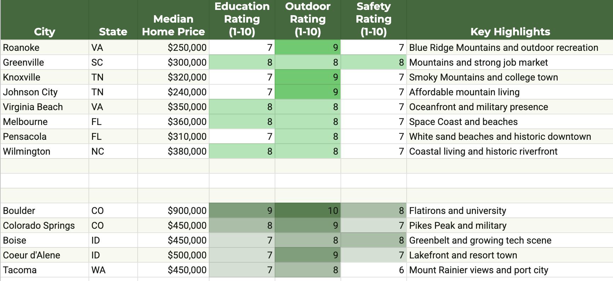

# Thought Experiment - Living in Tacoma in 1975

The previous owners of our house, the Girolamis, bought it in 1987.  Before that it was the Morgans from 1975.  Let's travel back to 1975 and imagine Edward Morgan and his perspective...  

The city had just built the Bayside Trail.  Environmentalism was on the uptick.  We'd landed on the moon.  The oil crisis hadn't hit yet and the go go years were in full swing.  It was a time of optimism.

Living in Tacoma at that moment, I would have imagined Boeing to grow, maybe a spaceport to augment the bustling seaport as a multimodel hub.  Nixon had just opened up China in 1972, so the PNW was an obvious trade hub.  What a great place to be!

The PNW then lost 2 decades.  That rough patch culmitated in Boeing moving to Chicago in 2001.  Meanwhile Microsoft minted millionaires in insular Redmond.

The dot com boom brought things back.  Amazon carried that through the bust and into cloud.  That all came to a screeching halt with COVID.  In Seattle, Cal Anderson Park was turned into CHOP/CHAZ with communists digging up the park for failed micro farms.  The police put concrete barriers up in front of the station.  Homeless camps expanded from small Nickelsvilles to take over the downtown and SODO.  

Similar things happened in Tacoma and Portland.

6 years, in 2026, on we've been unable to reverse that crumbling even as employers like Starbucks and Oracle leaving for Nashville.

So, let's imagine you are Morgan in 1975.  He was already 58 at the time.  Let's instead assume you're younger.  In my case 45.  You're about to buy a grand old house.  

You've got 30 years to run perhaps.  You have inexplicable knowledge of the future.  That is you could last to 2005 in Tacoma.  You know it's going to get rough.  The optimism of the mid 70s will not hold.

Do you follow through?  Or do you say "just kidding" and pop off somewhere else?  I think you probably get the hell out.  I hear Boulder, CO from 1975 to 2005 was pretty nice...

## Back to the Future

Back to the present, what do you do?  The current state is less good than 1975 Tacoma.  Lord knows I have tried (and largely failed) to fix it.  My crowning success is a 3/4 mile trail restored through Garfield Gulch.  That took a mix of hard labor, persisent follow up with government officials and a tolerance for retribution.

If the course is onward at the constant course, I think the clear answer is to check out.

But, things might be changing.

If speculation about climate change is correct, the PNW will increasingly be a good place to live.  It's unlikely we'll get hurricanes.  The weather is wet.  There are hills to distrupt tornados.

The location on the globe is also appealing.  We should be a major trading hub.  Shipping lines exist to Asia.  Connections to Alaska and onward are easy.  We're centered between London, NY and Singapore.  If a full Northwest Passage opens up that would change even more.

There is lingering industrial expertise from Boeing and its suppliers, along with Bangor and Bremerton on the naval side.  We ought to be able to build things.

Similarly Microsoft left us with a suprisingly vibrant VC and startup ecosystem.  That's carried forward to Amazon, Google, Apple, Facebook, Oracle, SpaceX, OpenAI and Snowflake all opening shops in the area.  We have what could be the start of a virtuous cycle.

On the downside we have one party rule.  Democrats have caused decades of governance failure with little course adjustment or responsibility.  The current line is to blame everything on Trump.  I am dreadfully curious who will be the scapegoat when he retires to the golden arches in the sky.  Despite the protestations of his doctor, I can't imagine that is long.

Washington hasn't had a Republican governor since 1985!  At this point the Republican opposition is completely disorganized.  They no longer put forward viable candidates for most offices.  Case in point is Solan, a cop with a problematic record and patchy voting history who is unfamilar with Tacoma issues, seemingly betting that broader Pierce County will carry him to a win.  I doubt that is the case.

As national problems arise, there's been a shift further left in the PNW.  The DSA has been able to get initiatives through.  Candidates might be coming.

"It's always darkest before pitch black."

Things can get a lot worse.  The November rental restriction and income tax uphold will drive business and capital from our area.  It's a signal to investors that this is a hostile environment.  It will also continue the vicious cycle of declining industry feeding more taxes to pay for bread and circuses.

Things can also get a lot better.  Our politics is the only factor holding us back.  Geography, infrastructure, weather, skill base and capital are all good.

## A politically infeasible program to fix Tacoma

Locally, fixing all this is quite actionable.  The problem is that the people we've elected are not interested in simple governance.  Rather they want to advance their political careers.  That is done through capital projects, not repsonsible operational spending.

A simple program like this could fix most of the problems in Tacoma.

(1) Reopen city offices M-F, 9-5.  Require city employees to be in office.  This will simplify permitting and licensing.  It will also improve downtown by having people actually there, buying coffee, lunch and going out for happy hour after work.

(2) Police.  Community policing prevents crime and makes cities safe.  Reopen the police station to the public.  Require cops to patrol.  Enforce laws.  Cut 911 times and actually respond to calls. Fire police who want to be desk jockeys.

(3) Reopen closed public spaces.  Remove fences and rocks.  Perform normal maintenance.  Clean up garbage.

(4) Cut admin overhead.  We know a single ADA ramp costs $16k.  We know most of that is overhead, something on the order of $10k.  There is no doubt similar waste throughout the government.  We can cut that.

(5) Invest in basic infrastructure and upkeep.  Pave our roads.  Water our parks.  Stop spending on new CapEx if the OpEx budget is insufficient.

(6) End homeless programs that don’t work.  Zero the budget for purple bag, narcan, HEAL, fences and rocks.  Put the money into cheap simple cots and policing to make sure people use them instead of sleeping on the streets.

(7) Stack rank all city spending.  End programs that fall below the budget available.  That probably means cutting programs like $5m/year participatory budgeting.

(8) Offer incentives for business to invest in downtown.

## The Takeaway

I don't know if it makes sense to stay and keep trying to fix things.  I'm worried about our kids.  The oldest started preschool on Tuesday.  That seems fine so far.  Though, it's not like 1990s Boulder where all the parents were scientists at NCAR, NIST and NOAH.

I have pretty deep concerns about the elementary school and onward.  Some places I think are on a better trajectory, though possibly with less opportunity include:

