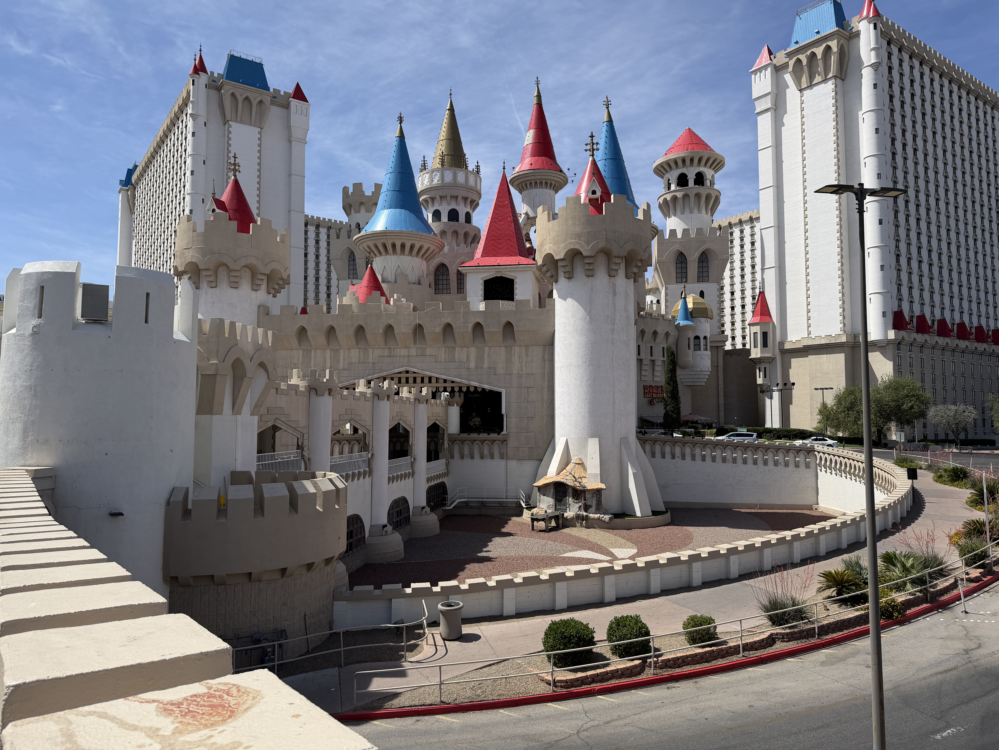

# Vegas

I'm in Vegas for a conference and thinking about what it might be in 30 years.  I first visited for a machine learning conference in 2005.  I drove from Colorado and I can still remember the light of Luxor visible in the night sky from miles out.  I bought a sundae at Hagan Daz that was something like $10 which I could not at all afford -- I was a grad student out to present a paper.  I think the school paid my milage and one night of hotel.

Vegas is not well.  The slot machines are largely empty.  Restaurants are no longer 24 hours, instead the Starbuck at NY NY is closed Tuesday and Wednesday.  The Miracle Mile has missing ceiling tiles.  The fountains at Excalibur are dry.

In person gaming revenues peaking in 2019.  Since then online revenues have grown, taking total revenue upward.  At the same time, Vegas revenues have fallen.

The city tried to reinvent itself as a premium dining destination, starting in perhaps 2015 with entries from Boloud, Keller and such.  The gambling subsidized buffets faded away.

The fine dining is fading off as well.  Conferences are left.  But the city wasn't designed for conferences.  The Orlando conference center makes it easy to get from talk to talk.  Vegas tortures you by trying to lose you in a maze of slot machines.

The city fundamentally should not exist.  It was regulatory arbitrage with gangsters, fleeing to a lawless land.  At least, that's what I learned from some Godfather sequel.  There is no water.  There is no oil.  There is no reason for it to exist.  I think it may end up as picked in that Blade Runner sequel surprisingly soon.
